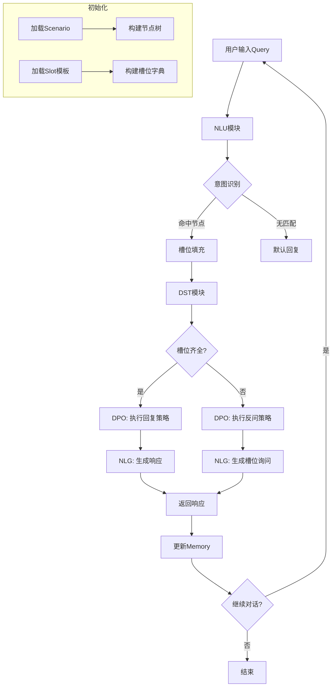
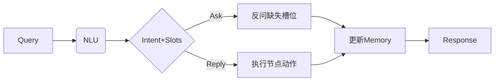
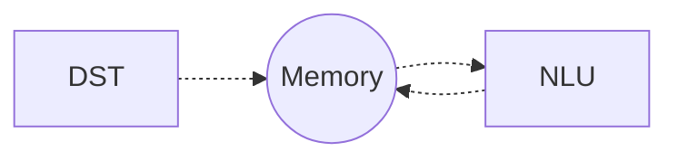

```mermaid
graph TD
    A[用户输入Query] --> B[NLU模块]
    B --> C{意图识别}
    C -->|命中节点| D[槽位填充]
    C -->|无匹配| E[默认回复]
    D --> F[DST模块]
    F --> G{槽位齐全?}
    G -->|是| H[DPO: 执行回复策略]
    G -->|否| I[DPO: 执行反问策略]
    H --> J[NLG: 生成响应]
    I --> K[NLG: 生成槽位询问]
    J --> L[返回响应]
    K --> L
    L --> M[更新Memory]
    M --> N{继续对话?}
    N -->|是| A
    N -->|否| O[结束]

    subgraph 初始化
        P[加载Scenario] --> Q[构建节点树]
        R[加载Slot模板] --> S[构建槽位字典]
    end
    


```

```mermaid
graph LR
    A[Query] --> B(NLU)
    B --> C{Intent+Slots}
    C -->|Ask| D[反问缺失槽位]
    C -->|Reply| E[执行节点动作]
    D --> F[更新Memory]
    E --> F
    F --> G[Response]
```

```mermaid
graph LR
    memory((Memory)) -.-> NLU
    NLU -.-> memory
    DST -.-> memory
```